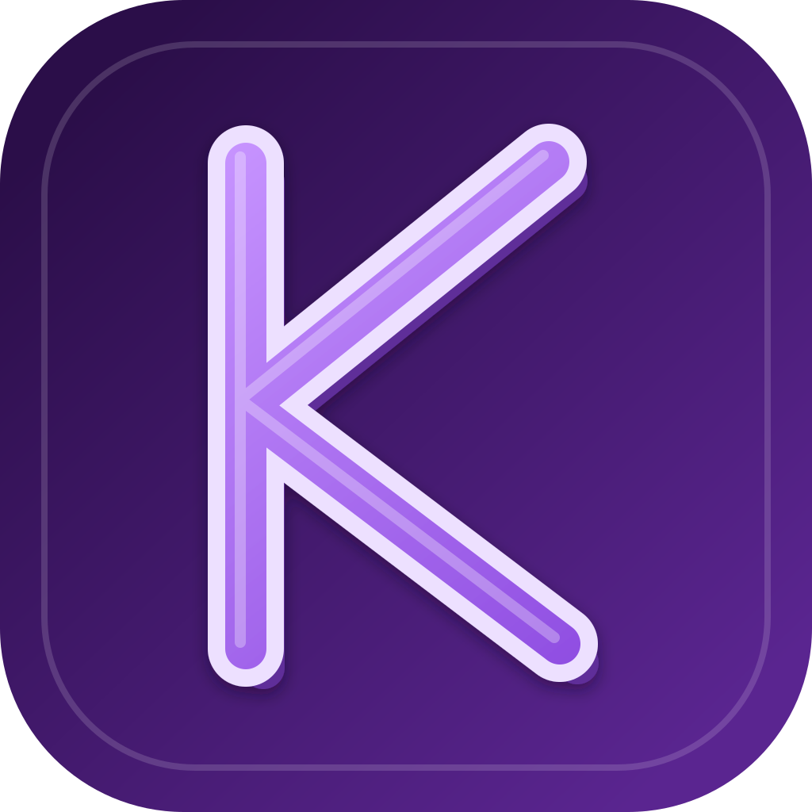

<div align="center">



# Kilt

**A proper E926/Self21 client**

[](https://flutter.dev)
[](https://dart.dev)
[](LICENSE)

</div>

Kilt is a cross-platform Flutter client for E926 and Self21-compatible image boards. It provides a modern, feature-rich interface for browsing, searching, and managing posts across desktop and mobile platforms.

## Features

- **Cross-platform support** - Runs on Linux, Windows, macOS, Android, and iOS
- **Post browsing** - View posts in gallery or list view with infinite scroll
- **Advanced search** - Filter by tags, ratings, and custom search parameters
- **Feed management** - Create and manage custom feeds for quick access
- **Favorites & bookmarks** - Save and organize your favorite posts and users
- **Comment system** - Read and reply to comments on posts
- **Pool support** - Browse and manage post pools
- **User profiles** - View user profiles, favorites, and uploads
- **Wiki & tags** - Access wiki pages and tag information
- **History tracking** - Keep track of your browsing history
- **Local caching** - Efficient caching for offline browsing
- **Dark theme** - Built-in dark mode with customizable accent colors

## Prerequisites

- [Flutter](https://flutter.dev/docs/get-started/install) SDK 3.32.0 or higher
- Dart SDK 3.8.0 or higher
- An E926-compatible host (e.g. [e926.net](https://e926.net)) or a [Self21](https://gitlab.com/HttpAnimations/Self21) instance

> [!NOTE]
> Platform-specific requirements:
> - **Linux**: No additional dependencies required
> - **Windows**: No additional dependencies required
> - **macOS**: Xcode command line tools for iOS builds
> - **Android**: Android SDK and Android Studio
- **iOS**: Xcode and an Apple Developer account for device deployment

## Getting Started

### Clone the repository

```bash
git clone https://gitlab.com/Openlyst/klit.git
cd klit
```

### Install dependencies

```bash
flutter pub get
```

### Run the app

```bash
# Run on connected device
flutter run

# Run on specific platform
flutter run -d linux
flutter run -d windows
flutter run -d macos
flutter run -d android
flutter run -d ios
```

## Building

### Desktop builds

```bash
flutter build linux
flutter build windows
flutter build macos
```

### Mobile builds

```bash
flutter build apk
flutter build ios
```

## Supported Platforms

| Platform | Status |
|----------|--------|
| Linux | ✅ Supported |
| Windows | ✅ Supported |
| macOS | ✅ Supported |
| Android | ✅ Supported |
| iOS | ✅ Supported |

## Configuration

Kilt connects to E926-compatible instances out of the box. To use a custom Self21 instance:

1. Open the app settings
2. Navigate to the server configuration section
3. Enter your Self21 instance URL
4. Save and restart the app

## Development

Kilt is built with Flutter and uses:
- **Riverpod** for state management
- **go_router** for navigation
- **Drift** for local database
- **Dio** for HTTP requests
- **media_kit** for video playback

To run the app in development mode with hot reload:

```bash
flutter run
```

## License

This project is licensed under the AGPL-3.0 License - see the [LICENSE](LICENSE) file for details.
